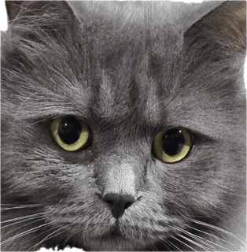

# BERKCTEZC

Hey, I’m happy to see you here. I am Berkcan and currently located in Ankara/Turkey. I graduated from Istanbul Kultur University, Mathematics and Computer Science in 2020 and currently working at an industry-leading company named Loodos. I love programming and tech, sometimes i blog about things i learned to share my knowledge on medium. I always enjoy learning new things and add more technologies, tools to my toolkit. Outside of tech, I love rock and metal music both listening and playing. I play guitar and bass in my spare time and trying to learn mixing and mastering on various music software. 

---

💿 **Operating Systems:** macOS  | Linux  (//) | Windows 

😏 **Hobbies:** Guitar & Bass 🎸 | Video Games 🕹️ | Movies 📼 | Music 🎧 | Board Games 🎲 | Homelab 📟 | Cooking 🍲 | Coffee ☕️ | Mixology 🧉

🌍 [**All my links**](https://berkctezc.github.io)

<h2>📝 Recent blog posts (Mixed Languages)</h2>

    
Click to expand

    <ul>
        <li><a href="https://berkctezc.medium.com/the-correct-way-to-install-openvpn-client-on-linux-9aebd759ba73" target="_blank">⚙️ OpenVPN Linux Configuration</a></li>
        <li><a href="https://berkctezc.medium.com/ui-ux-design-temelleri-ve-ba%C5%9Flang%C4%B1%C3%A7-yolharitas%C4%B1-944a302ee4d6" target="_blank">⚙️ UI/UX Design Temelleri ve Başlangıç Yolharitası</a></li>
        <li><a href="https://berkctezc.medium.com/zero-to-one-411a91aeeadd" target="_blank">⚙️ Zero to One‘dan Notlar</a></li>
        <li><a href="https://berkctezc.medium.com/bash-komutlar%C4%B1-47a0811260e3" target="_blank">⚙️ Bash Komutları</a></li>
        <li><a href="https://berkctezc.medium.com/git-kullanimi-75dfdde77692" target="_blank">⚙️ Git Kullanmaya Başlayalım</a></li>
    </ul>

<h2>👨‍💻 Learning and Using</h2>

    
Click to expand

<ul>
    

        
        
        
        
        
        
        
        
    

<h2>🧰 Software and Tools</h2>

    
:suspect: Click to expand

    <ul>
        

            
            
            
            
            
            
        

<h2>:octocat: GitHub Stats</h2>

    
Click to expand

    

     
    

---

    
     
    
    
    

        
Top Secret!

        
        
😼 MEOW, I'M LEIA :shipit: 

         
        
        
😽 MEOW, I'M MICKEY :shipit: 

    

    

