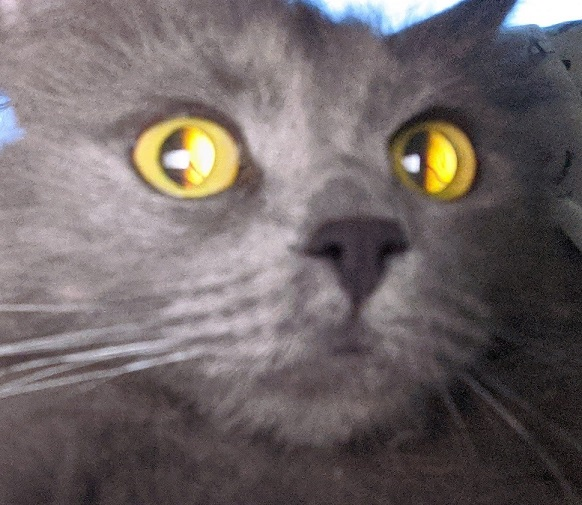
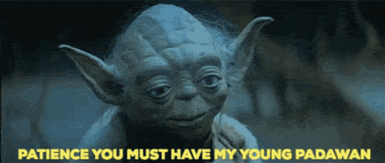

# BERKCTEZC

Hey, i am happy to see you here. I am Berkcan and currently living in Istanbul/Turkey. I recently graduated from Istanbul Kultur University, Mathematics and Computer Science in 2020. I love programming and tech, sometimes i blog about things i learned to share my knowledge on medium. I always enjoy learning new things and add more technologies, tools to my toolkit. Outside of tech i love rock and metal music both listening and playing. I play guitar and bass in my spare time and trying to learn mixing and mastering on various music software. 

---

:diamond_shape_with_a_dot_inside: **Operating Systems:** :penguin: EndeavourOS KDE & :capital_abcd: Windows 10 Pro

:smirk: **Hobbies:** :guitar: Guitar & Bass | ✍ Blogging | :video_game: Video Games | :vhs: Movies | :headphones: Music | :mountain: Trekking | 🏋️ GYM

:earth_asia: [**All my links**](https://berkctezc.github.io) 

<h2> 📝 Recent blog posts (In Turkish)</h2>

    
Click to expand

<ul> 
<li><a href="https://berkctezc.medium.com/ui-ux-design-temelleri-ve-ba%C5%9Flang%C4%B1%C3%A7-yolharitas%C4%B1-944a302ee4d6" target="_blank">⚙️ UI/UX Design Temelleri ve Başlangıç Yolharitası</a></li>
<li><a href="https://berkctezc.medium.com/zero-to-one-411a91aeeadd" target="_blank">⚙️ Zero to One‘dan Notlar</a></li>
<li><a href="https://berkctezc.medium.com/bash-komutlar%C4%B1-47a0811260e3" target="_blank">⚙️ Bash Komutları</a></li>
<li><a href="https://berkctezc.medium.com/git-kullanimi-75dfdde77692" target="_blank">⚙️ Git Kullanmaya Başlayalım</a></li>
</ul>

<h2> 👨‍💻 Learning and Using</h2>

    
Click to expand

<ul> 

    
    
    
    
    
    
    
    
    
    
    
    
    
    
    

<h2> 🧰 Software and Tools</h2>

    
Click to expand

<ul>

    
    
    
    
    
    
    
    
    
    
    
    

<h2> 💼 Job </h2>
    I'm working as a Software Developer at <a target="_blank" href="https://tiko.es">Tiko</a>
    
<h2> 🐙 GitHub Stats </h2>

    
Click to expand

 

---

     
    <!-- Spotify

-->
 

 

  
Top Secret!

 
     
 
🙀 MEOW, I'M LEIA

 

